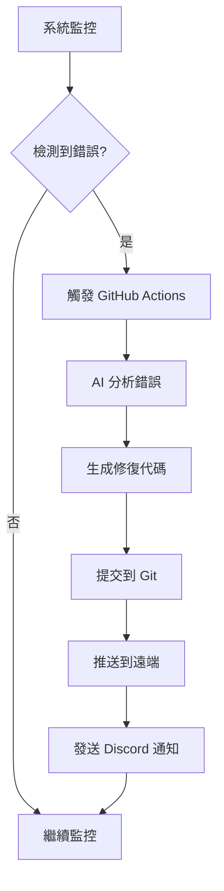
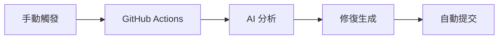

# 自動 AI Debug 系統

> 2026-05-26 校正：目前已驗證的 VM 常駐入口是 `config/services/auto-debug.service` 啟動 `scripts/auto_error_detector.py`。主幹流程已收斂為「分析問題 -> debug -> push」，不再把本地 AI 摘要分析或遠端營運自癒當成主流程。

## 概述

自動 AI Debug 系統是一個完整的端到端自動化解決方案，能夠：

1. **自動檢測系統錯誤**：持續監控 Discord Bot 服務狀態
2. **觸發 GitHub Actions**：檢測到錯誤時自動觸發 AI 分析
3. **AI 分析和修復**：使用 NVIDIA AI 深度分析錯誤並生成修復代碼
4. **自動上傳修復**：將修復代碼自動提交到專案

## 系統架構

```
┌─────────────────┐    ┌─────────────────┐    ┌─────────────────┐    ┌─────────────────┐
│   Auto Debug   │───▶│  GitHub Actions │───▶│   NVIDIA AI    │───▶│   Git Repository │
│     System     │    │   Workflow     │    │   Analysis      │    │   Auto Commit   │
│                │    │                │    │                │    │                │
│ • 監控服務狀態  │    │ • 接收觸發     │    │ • 錯誤分析     │    │ • 自動提交     │
│ • 檢測錯誤     │    │ • AI 分析       │    │ • 修復代碼生成   │    │ • 推送修復     │
│ • 觸發工作流程  │    │ • 通知發送     │    │ • 根本原因分析   │    │ • 版本控制     │
└─────────────────┘    └─────────────────┘    └─────────────────┘    └─────────────────┘
```

## 核心組件

### 1. Auto Debug Detector (`scripts/auto_error_detector.py`)

**功能**：
- 直接掃描 `bot.service`、`shopbot.service`、`uibot.service` 的 systemd journal
- 錯誤日誌分析
- GitHub Actions 觸發
- Discord 通知發送

**監控邏輯**：
```python
for service in ["bot.service", "shopbot.service", "uibot.service"]:
    lines = read_journal_lines(service)
    for line in lines:
        if re.search(r"Traceback|HTTPException|ImportError|AttributeError", line, re.I):
            # 直接 dispatch 到 GitHub Actions 做分析 / debug / push
```

**觸發條件**：
- 服務狀態為 `inactive` 或 `failed`
- 1小時內檢測到2個以上錯誤關鍵字
- 手動強制觸發

### 2. GitHub Actions Workflow (`.github/workflows/auto-ai-fix.yml`)

**觸發方式**：
- `repository_dispatch` 事件（來自 Auto Debug System）
- 事件類型：`system_debug`

**執行步驟**：
1. 檢出代碼
2. 設定 Python 環境
3. 安裝依賴
4. 執行 AI 修復腳本
5. 直接寫入目標檔案
6. 自動提交和推送

### 3. AI Fix Script (`scripts/auto_ai_fix.py`)

**AI 分析流程**：
```python
# 1. 初始化 NVIDIA AI 客戶端
client = NVIDIAAIClient()

# 2. 構建分析提示
analysis_prompt = f"""
你是KKGroup Discord Bot系統的AI除錯和修復專家。

系統環境：
- GCP VM: e2-micro (1GB RAM + 4GB swap)
- 三個Bot服務: bot.service, shopbot.service, uibot.service
- 技術棧: Python 3.11 + Discord.py + systemd

錯誤日誌：
{error_logs}

請分析並生成修復代碼：
1. 根本原因分析
2. 具體修復代碼（Python）
3. 修復後的驗證方法
4. 預防措施
"""

# 3. 調用 NVIDIA AI
response = await client.call_api(
    messages,
    model="deepseek-ai/deepseek-v4-pro",
    max_tokens=2000
)
```

**修復代碼生成**：
- JSON 格式回覆解析
- 自動文件寫入
- Git 提交和推送
- Discord 通知

### 4. Systemd Service (`config/services/auto-debug.service`)

**服務配置**：
```ini
[Unit]
Description=KKGroup Auto Error Detector
After=network-online.target systemd-resolved.service

[Service]
Type=simple
User=e193752468
WorkingDirectory=/home/e193752468/kkgroup
ExecStart=/home/e193752468/kkgroup/venv/bin/python /home/e193752468/kkgroup/scripts/auto_error_detector.py
Restart=on-failure
RestartSec=30

[Install]
WantedBy=multi-user.target
```

## 設置和部署

### GitHub Secrets 配置

| Secret 名稱 | 描述 | 必需性 |
|-------------|--------|----------|
| `NVIDIA_API_KEY` | NVIDIA API 金鑰 | 必需 |
| `DISCORD_WEBHOOK_URL` | Discord Webhook URL | 必需 |
| `GITHUB_TOKEN` | GitHub Personal Access Token | 必需 |
| `GCP_SA_KEY` | GCP Service Account Key | 可選 |

### 系統部署

```bash
# 1. 安裝服務
sudo cp config/services/auto-debug.service /etc/systemd/system/

# 2. 重新載入 systemd
sudo systemctl daemon-reload

# 3. 啟動服務
sudo systemctl start auto-debug.service

# 4. 設置開機自啟
sudo systemctl enable auto-debug.service
```

## 工作流程

### 自動模式流程



### 手動觸發流程



## 監控和日誌

### 系統日誌查看

```bash
# 查看自動 Debug 服務日誌
sudo journalctl -u auto-debug.service -f

# 查看最近的日誌
sudo journalctl -u auto-debug.service -n 50

# 查看服務狀態
sudo systemctl status auto-debug.service
```

### GitHub Actions 日誌

1. 進入 GitHub Actions 頁面
2. 點擊具體的工作流程執行
3. 查看各個步驟的詳細日誌

## 故障排除

### 常見問題和解決方案

#### 1. 服務無法啟動

**症狀**：
```
Failed to start auto-debug.service: Unit auto-debug.service not found.
```

**解決方案**：
```bash
# 檢查服務文件是否存在
ls -la /etc/systemd/system/auto-debug.service

# 重新複製服務文件
sudo cp config/services/auto-debug.service /etc/systemd/system/

# 重新載入 systemd
sudo systemctl daemon-reload
```

#### 2. GitHub Actions 觸發失敗

**症狀**：
```
❌ 未設置 GITHUB_TOKEN，無法觸發 GitHub Actions
```

**解決方案**：
```bash
# 檢查環境變數
echo $GITHUB_TOKEN

# 設置環境變數
export GITHUB_TOKEN=your_token_here
```

#### 3. NVIDIA API 調用失敗

**症狀**：
```
❌ NVIDIA API 調用失敗: 401 Unauthorized
```

**解決方案**：
1. 檢查 NVIDIA_API_KEY 是否正確
2. 確認 API 配額是否用完
3. 驗證網路連接

#### 4. Git 提交失敗

**症狀**：
```
❌ 創建修復文件失敗: [Errno 13] Permission denied
```

**解決方案**：
```bash
# 檢查 Git 配置
git config --list

# 重新配置 Git
git config --global user.name "AI Auto Fix Bot"
git config --global user.email "ai-fix@kkgroup.local"
```

## 效能調整

### 監控頻率調整

在 `auto_debug_system.py` 中修改：
```python
# 調整檢查間隔（秒）
await asyncio.sleep(30)  # 更頻繁檢查
await asyncio.sleep(120) # 較少檢查
```

### 錯誤閾值調整

```python
# 調整錯誤觸發閾值
error_threshold = 1  # 更敏感
error_threshold = 5  # 較不敏感
```

### AI 模型選擇

```python
# 更換 AI 模型
model="deepseek-ai/deepseek-v4-pro"     # 最強編程模型
model="nvidia/nemotron-3-super-120b-a12b"  # NVIDIA 最強模型
model="mistralai/mistral-medium-3.5-128b"  # 平衡性能
```

## 安全考量

### API 金鑰保護

1. **環境變數存儲**：所有金鑰存儲在環境變數中
2. **GitHub Secrets**：使用 GitHub Secrets 管理敏感資訊
3. **權限最小化**：只給予必要的權限

### 系統隔離

1. **用戶隔離**：使用專用用戶 `e193752468`
2. **服務隔離**：獨立的 systemd 服務
3. **日誌隔離**：獨立的日誌文件

## 未來改進方向

### 1. 增強監控能力

- 添加更多服務監控（資料庫、快取等）
- 實現效能指標監控
- 添加預警閾值配置

### 2. AI 能力擴展

- 支援多個 AI 模型比較
- 添加修復代碼驗證
- 實現修復效果追蹤

### 3. 自動化程度提升

- 自動部署修復代碼
- 自動回滾失敗修復
- 智能修復排程

## 相關文檔

- [NVIDIA AI 集成指南](../nvidia-ai-integration.md)
- [GitHub Actions 工作流程](../github-actions-workflows.md)
- [系統部署指南](../../deployment/system-deployment.md)
- [故障排除手冊](../troubleshooting/debug-system-troubleshooting.md)
