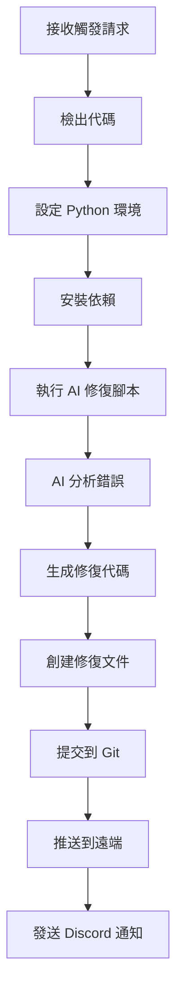

# GitHub Actions 工作流程

## 概述

GitHub Actions 工作流程是自動 AI Debug 系統的執行引擎，負責協調各個組件的自動化執行。

## 工作流程架構

```
┌─────────────────┐    ┌─────────────────┐    ┌─────────────────┐
│   AI Debug     │───▶│   Auto AI Fix   │───▶│   Test NVIDIA   │
│   Monitor      │    │   Workflow      │    │   API Workflow  │
│                │    │                │    │                │
│ • 手動觸發     │    │ • 自動觸發     │    │ • API 測試     │
│ • 定時執行     │    │ • AI 分析       │    │ • 模型驗證     │
│ • 實時分析     │    │ • 修復生成       │    │ • 連接測試     │
│ • 系統監控     │    │ • 自動提交       │    │ • 錯誤處理     │
└─────────────────┘    └─────────────────┘    └─────────────────┘
```

## 核心工作流程

### 1. AI Debug Monitor (`.github/workflows/ai-debug-monitor.yml`)

**觸發條件**：
```yaml
on:
  push:
    branches: [ main, master ]
    paths-ignore:
      - 'docs/**'
      - 'README.md'
      - '.gitignore'
  workflow_dispatch:
    inputs:
      debug_type:
        description: 'Debug 類型'
        required: false
        default: 'auto'
        type: choice
        options:
          - auto
          - force
          - test
      log_content:
        description: '自定義日誌內容（可選）'
        required: false
        type: string
  repository_dispatch:
    types: [error_analysis]
  schedule:
    - cron: '0 19 * * *'  # 每天凌晨 3 點
    - cron: '0 */6 * * *'  # 每 6 小時
```

**執行步驟**：
1. **環境設置**
   ```yaml
   - name: 設定Python環境
     uses: actions/setup-python@v4
     with:
       python-version: '3.11'
   
   - name: 設定 Python 路徑
     run: |
       echo "PYTHONPATH=$GITHUB_WORKSPACE:$PYTHONPATH" >> $GITHUB_ENV
   ```

2. **依賴安裝**
   ```yaml
   - name: 安裝依賴
     run: |
       pip install requests aiohttp python-dotenv pytz google-cloud-compute
   ```

3. **GCP 認證設置**
   ```yaml
   - name: 設置 GCP 認證
     env:
       GCP_SA_KEY: ${{ secrets.GCP_SA_KEY }}
     run: |
       echo "$GCP_SA_KEY" > gcp-key.json
       export GOOGLE_APPLICATION_CREDENTIALS=gcp-key.json
       gcloud auth activate-service-account --key-file=gcp-key.json --project=kkgroup
   ```

4. **AI 分析執行**
   ```yaml
   - name: AI 錯誤分析器
     env:
       NVIDIA_API_KEY: ${{ secrets.NVIDIA_API_KEY }}
       DISCORD_WEBHOOK: ${{ secrets.DISCORD_WEBHOOK_URL }}
     run: |
       python3 << 'EOF'
       # AI 分析邏輯
       EOF
   ```

**功能模式**：

#### Auto 模式
- 自動檢測系統錯誤
- 優先使用真實 VM 日誌
- 失敗時使用模擬日誌
- 節省 API 配額

#### Force 模式
- 強制執行 AI 分析
- 使用自定義日誌或預設測試日誌
- 繞過系統正常檢查

#### Test 模式
- 簡單的測試日誌
- 驗證 NVIDIA API 連接
- 快速功能測試

### 2. Auto AI Fix (`.github/workflows/auto-ai-fix.yml`)

**觸發條件**：
```yaml
on:
  repository_dispatch:
    types: [system_debug]  # 接收來自自動 Debug 系統的請求
```

**執行流程**：


**修復腳本執行**：
```yaml
- name: 執行 AI 修復
  env:
    NVIDIA_API_KEY: ${{ secrets.NVIDIA_API_KEY }}
    DISCORD_WEBHOOK: ${{ secrets.DISCORD_WEBHOOK_URL }}
    GITHUB_EVENT_DATA: ${{ toJSON(github.event) }}
  run: |
    python3 scripts/auto_ai_fix.py
```

### 3. Test NVIDIA API (`.github/workflows/test-nvidia-api.yml`)

**觸發條件**：
```yaml
on:
  workflow_dispatch:
  push:
    branches: [ main ]
    paths:
      - 'utils/nvidia_ai.py'
```

**測試內容**：
- NVIDIA API 連接測試
- 多模型功能驗證
- 錯誤處理測試
- 性能基準測試

## 工作流程配置

### 權限設置

```yaml
permissions:
  contents: write      # 寫入倉庫內容
  issues: write       # 創建和編輯 Issues
  pull-requests: write  # 創建和編輯 Pull Requests
  id-token: write      # OIDC 身份驗證
```

### 環境變數

```yaml
env:
  # 強制使用 Node.js 24 避免 deprecation 警告
  FORCE_JAVASCRIPT_ACTIONS_TO_NODE24: true
```

### Secrets 配置

| Secret 名稱 | 描述 | 用途 | 必需性 |
|-------------|--------|------|----------|
| `NVIDIA_API_KEY` | NVIDIA API 金鑰 | AI 分析 | 必需 |
| `DISCORD_WEBHOOK_URL` | Discord Webhook URL | 通知發送 | 必需 |
| `GITHUB_TOKEN` | GitHub Personal Access Token | 代碼提交 | 必需 |
| `GCP_SA_KEY` | GCP Service Account Key | VM 連接 | 可選 |

## 執行環境

### Runner 配置

```yaml
runs-on: ubuntu-latest
```

**規格**：
- 2-core CPU
- 7 GB RAM
- 14 GB SSD 硬碟空間
- Ubuntu 22.04 LTS

### Python 環境

```yaml
- name: 設定Python環境
  uses: actions/setup-python@v4
  with:
    python-version: '3.11'
```

## 監控和日誌

### 執行日誌

每個工作流程執行都會產生詳細日誌：

```bash
# 查看工作流程執行
- AI 分析完成，使用模型: deepseek-v4-pro
- 📁 工作目錄: /home/runner/work/kkgroup
- ✅ NVIDIA AI 客戶端初始化成功
```

### 錯誤處理

```yaml
# 錯誤回滾機制
- uses: actions/checkout@v4
  continue-on-error: false

# 失敗通知
- name: 通知失敗
  if: failure()
  run: |
    echo "❌ 工作流程執行失敗"
```

### 效能監控

```yaml
# 執行時間監控
- name: 記錄執行時間
  run: |
    echo "開始時間: $(date)"
    # ... 執行步驟 ...
    echo "結束時間: $(date)"
```

## 工作流程最佳化

### 並行執行

```yaml
jobs:
  ai-analysis:
    # AI 分析工作
  auto-fix:
    # 自動修復工作
    needs: ai-analysis  # 依賴分析完成
```

### 條件執行

```yaml
- name: 條件步驟
  if: github.event_name == 'push' && github.ref == 'refs/heads/main'
  run: |
    echo "只在推送到 main 分支時執行"
```

### 快取策略

```yaml
- name: 快取依賴
  uses: actions/cache@v3
  with:
    path: ~/.cache/pip
    key: ${{ runner.os }}-pip-${{ hashFiles('**/requirements.txt') }}
```

## 故障排除

### 常見問題

#### 1. 工作流程執行失敗

**症狀**：
```
Error: The workflow is not valid. .github/workflows/ai-debug-monitor.yml (Line: 45, Col: 1)
```

**解決方案**：
```yaml
# 檢查 YAML 語法
- 縮排正確
- 空格使用
- 引號配對
```

#### 2. Secrets 未設置

**症狀**：
```
Error: Required secret not found: NVIDIA_API_KEY
```

**解決方案**：
1. 進入 Repository Settings
2. Secrets and variables → Actions
3. 添加新的 repository secret
4. 重新執行工作流程

#### 3. 權限不足

**症狀**：
```
Error: Permission denied: could not read from repository
```

**解決方案**：
```yaml
# 更新權限配置
permissions:
  contents: write
  pull-requests: write
  issues: write
```

## 安全考量

### Secrets 管理

1. **最小權限原則**：只給予必要的權限
2. **定期輪換**：定期更換 API 金鑰
3. **審計日誌**：監控 Secrets 使用情況

### 代碼安全

1. **輸入驗入驗證**：驗證所有外部輸入
2. **錯誤處理**：避免敏感資訊洩漏
3. **日誌過濾**：避免記錄敏感資訊

## 相關文檔

- [自動 AI Debug 系統](automatic-ai-debug-system.md)
- [NVIDIA AI 集成](nvidia-ai-integration.md)
- [系統部署指南](../../deployment/system-deployment.md)
- [故障排除手冊](../troubleshooting/github-actions-troubleshooting.md)

---

**更新時間**：2024-05-12  
**版本**：1.0.0  
**維護者**：GitHub Actions Workflow Team
