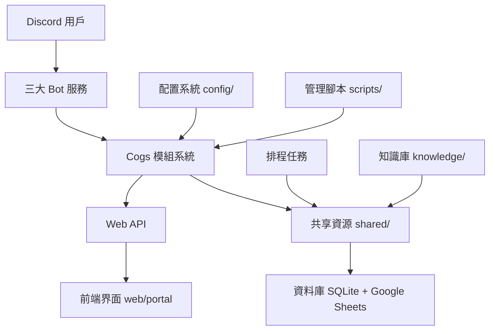

# KKGroup 專案架構總覽

## 專案概述

KKGroup 是一個基於 Discord 的多功能機器人系統，包含遊戲、商店、UI 管理、AI 記憶、知識庫等多個模組，部署在 GCP VM (e2-micro, Ubuntu 20.04) 上。

## 核心架構

### 1. Discord Bot 系統 (`bots/`)
- **主 Bot** (`bot.py`): 核心機器人功能、指令處理、用戶管理
- **商店 Bot** (`shopbot.py`): 處理商店、經濟、大麻種植相關功能
- **UI Bot** (`uibot.py`): 處理用戶界面、置物櫃、動漫追蹤、活動互動
- **啟動入口** (`__main__.py`): 統一的啟動點

### 2. Cogs 模組系統 (`cogs/`)
採用模組化設計，分為三大類別：

#### Common Cogs (`cogs/common/`) — 16+ 核心功能模組
- **AI.py** / **ai_client_liteLLM.py**: AI 整合、LiteLLM 客戶端
- **kcoin.py** / **kkcoin_visualizer.py**: KK 幣查詢、排行榜、視覺化
- **work_function/**: 工作相關功能集合
- **admin_restartbot.py**: 管理員重啟 Bot 指令
- **announcement.py**: 公告系統
- **auto_debug_system.py**: 自動除錯系統
- **fraud_voice.py**: 語音頻道反詐騙/自動清理
- **google_sheets_sync.py**: Google Sheets 同步
- **jail.py**: 監獄/懲罰系統
- **leaderboard_manager.py**: 排行榜管理
- **log_monitor.py**: 日誌監控
- **market_trends.py**: 市場趨勢分析
- **memory_manager.py**: 記憶管理
- **monitor_leaderboard_url.py**: 排行榜 URL 監控
- **nickname_id.py**: 暱稱/ID 管理
- **role_color_changer.py**: 角色顏色變更
- **shell_agent.py**: Shell Agent 整合
- **123.py**: 測試/工具模組

#### Shop Cogs (`cogs/shop/`) — 7+ 商店相關模組
- **shop.py**: 核心商店、購物、拉霸、裝備購買
- **cannabis_cog.py**: 大麻種植循環（種子/肥料購買、收成出售）
- **HospitalMerchant.py**: 醫院商家系統
- **enhanced_role_manager.py**: 強化角色管理
- **feedback_cog.py**: 回饋系統
- **role_expiration_manager.py**: 角色過期管理
- **stock_market.py**: 股票市場模擬
- **merchant/**: 商家核心功能（多商家 view 與交易流程）
  - `cannabis_config.py`, `cannabis_farming.py`, `cannabis_merchant_view_v2.py` 等

#### UI Cogs (`cogs/ui/`) — 16+ UI 互動模組
- **welcome_message.py**: 歡迎訊息、新用戶隨機造型（紙娃娃）
- **locker_panel.py** / **locker_maintenance.py** / **cannabis_locker.py**: 置物櫃系統
- **anime_tracker.py**: 動漫追蹤、投票獎勵 KK 幣
- **AvatarReset.py**: 頭像重置
- **ScamParkEvents.py**: 詐騙公園事件處理
- **fortress_defense.py**: 要塞防禦遊戲
- **new_year_red_envelope.py**: 紅包活動
- **personal_items.py**: 個人物品管理
- **push_core.py**: 推播核心
- **ranking_stats.py**: 排名統計
- **recovery_cog.py**: 復原功能
- **schedule_tracker.py**: 排程追蹤
- **threads_cookie_monitor.py**: 執行緒 Cookie 監控
- **uibody.py**: UI 主體
- **admin_locker_commands.py** / **admin_ui_commands.py**: 管理員指令
- **anti_advertising.py**: 反廣告
- **id_diagnosis.py**: ID 診斷
- **member_sync.py**: 成員同步
- **commands/**: 指令處理系統
- **events/**: 事件處理系統
- **tasks/**: 背景任務
- **utils/**: UI 工具
- **views/**: 視圖組件

### 3. Web 系統 (`web/`)
#### API 層 (`web/api/`)
- **api_server.py**: 主要 Flask API 服務
- **game_api.py**: 遊戲相關 API
- **unified_api.py**: 統一 API 聚合入口
- **game/**: Godot 遊戲專案（`.godot/`, `scenes/`, `scripts/`, `assets/`, `data/`）

#### 藍圖系統 (`web/blueprints/`) — 7 個模組化路由
- **discord_auth.py**: Discord OAuth 認證
- **sheet_driven_db.py**: 表格驅動資料庫 API
- **sheets.py**: Google Sheets 操作
- **sheet_sync_manager.py**: 表格同步管理
- **knowledge_api.py**: 知識庫 API
- **stats.py**: 統計 API
- **stocks_api.py**: 股票 API
- **sync_to_sheet.py**: 同步到表格
- **webhook.py**: GitHub Webhook 接收器（自動部署觸發點）

#### 前端 (`web/portal/`)
- **index.html**: 主要入口
- **rpg-game-tailwind.html** / **rpg-game.html**: HTML5 RPG 遊戲
- **admin.html**: 管理後台
- **static/**: CSS/JS/圖片靜態資源

#### 活動系統 (`web/activities/`)
- **merchant/**: 商家活動頁面

### 4. 共享資源 (`shared/`)
#### 資料庫 (`shared/db/`)
- **db_adapter.py**: 統一資料庫適配器（向後相容入口 `get_user_kkcoin()`, `update_user_kkcoin()`）
- **sheet_driven_db.py**: 核心引擎，Google Sheets 驅動欄位與同步
- **database_schema.py**: Schema 定義
- **ai_memory.py**: AI 長期記憶（topic/content/category + source_path/metadata/related_topics）
- **feature_usage.py**: 功能使用統計
- **knowledge_vector_index.py**: 知識向量索引
- **data/**: 資料檔案

#### 工具 (`shared/utils/`)
- **view_registry.py**: `PersistentViewBase` 永久視圖基類（`timeout=None` 自動處理）
- **embed_views.py**: `PersistentEmbedView` 臨時視圖（30秒超時）
- **fortress_system.py**: 要塞系統（活動成本與獎勵、KK 幣互動）
- **bot_status.py**: Bot 狀態監控
- **logger.py**: 統一日誌
- **encoding_handler.py**: 編碼處理
- **llm_text_router.py**: LLM 文字路由
- **mutual_rescue.py**: 互助救援
- **prompt_function_calling.py**: Prompt 函數呼叫

### 5. 工具程式 (`utils/`)
- **earthquake.py**: 地震資訊
- **env.py**: 環境變數管理
- **github.py**: GitHub 整合
- 其他工具模組

### 6. 配置系統 (`config/`)
- **config.json**: 主要配置
- **commands_registry.json**: 內部指令註冊表（`scripts/commands_manager.py` 使用）
- **discord_commands_registry.json**: Discord Slash Commands 註冊表
- **announcement_carousel.json**: 公告輪播配置
- **shop_config.backup.py**: 商店配置備份
- **nginx/**: Nginx 反向代理配置
- **services/**: systemd service 檔（僅 VM 管理，**不上傳 Git**）
- **sudoers/**: sudo 權限配置
- **scripts/**: 部署相關腳本

### 7. 排程任務 (`scheduled_tasks/`) — 8 個 Cron 任務
- **update_restart.py** / **sync_to_sheet.py**: 每 5 分鐘執行
- **refresh_all_lockers_cron.py**: 每週三、六 14:00 執行
- **weekly_backup.py**: 每週一 03:00 執行
- **refresh_knowledge_base.py**: 每天 18:00（台灣時間）執行
- **auto_update_config.py** / **auto_update_webhook_v2.py**: 自動更新相關
- **locker_maintenance.py**: 置物櫃維護
- **webhook_logger.py**: Webhook 日誌記錄

### 8. 腳本系統 (`scripts/`) — 20+ 管理腳本
- **commands_manager.py**: 統一維運入口（SSH、systemd、日誌、診斷）
- **scan_vm_state.py**: 掃描 VM 狀態 → 產生 `knowledge/_wiki/Inbox/vm-scan-latest.md`
- **ingest_knowledge.py**: 掃描 wiki 建立知識庫向量索引
- **sync-knowledge-to-vm.ps1** / **gcp-ssh.ps1**: PowerShell 管理腳本
- **fetch_db_from_gcp.ps1**: 從 GCP 抓取資料庫
- **auto_ai_fix.py** / **auto_error_detector.py** / **auto_self_heal.py**: 自動修復系統
- **check_anime_*.py**: 動漫資料檢查系列
- **test_*.py**: 測試腳本
- **update_tunnel_url_event.sh**: 隧道 URL 更新

### 9. 資源檔案
- **fonts/**: `NotoSansCJKtc-Regular.otf`（中文字體，**從 `cogs/common/` 參考需用 `../../fonts/`**）
- **character_images/**: Discord 頭像快取（`discord_url_cache.json`）
- **assets/**: 遊戲資源圖片
- **reaction_roles/**: Discord 反應角色配置
- **data/**: `threads_lottery_bets.json` 等資料檔
- **memory/**: 記憶相關資料

### 10. 歸檔系統 (`archive/`)
- **backups/**: 備份檔案
- **old_versions/**: 舊版本代碼
- **systemd/**: 系統配置備份
- 修復腳本集合（`fix_*.py`, `final_*.py` 等）

### 11. 根目錄關鍵檔案
- **db_adapter.py**: 根目錄也有一份（歷史原因，以 `shared/db/db_adapter.py` 為主）
- **kkgroup.db** / **user_data.db**: SQLite 資料庫
- **ruvector.db**: 向量資料庫
- **twms_fashion_db.json**: 紙娃娃時裝資料庫（來源真理）
- **locker_refresh_urls.json**: 置物櫃刷新 URL 配置
- **market_message_data.json**: 市場訊息資料
- **commands_inventory.json**: 指令清單
- **api_endpoints_index.json** / **api_index.json**: API 索引
- **requirements.txt**: Python 依賴
- **deploy_restructure.sh**: 部署重構腳本

## 資料流向

## 關鍵技術棧

### 後端
- **Python 3.10+**: 主要開發語言
- **discord.py 2.0+**: Discord API 整合（Slash Commands、Persistent Views）
- **Flask**: Web API 框架（Blueprints 模組化路由）
- **SQLite**: 本地資料庫（`check_same_thread=False` 連線池）
- **Google Sheets API**: 雲端試算表同步（Sheet-driven 架構）
- **asyncio**: 非同步處理（`asyncio.gather()` 平行操作）
- **LiteLLM**: 多模型 AI 客戶端整合

### 前端
- **HTML5/CSS3**: 基礎網頁技術
- **TailwindCSS**: 樣式框架
- **JavaScript**: 互動功能
- **Godot 4**: RPG 遊戲引擎（`web/api/game/`）

### 部署與維運
- **GCP VM (e2-micro)**: 主要部署環境（Ubuntu 20.04 LTS）
- **systemd**: 服務管理（3 Bot + API + cloudflared）
- **nginx**: 反向代理（port 80/443 → Flask 5000）
- **Cloudflare Tunnel**: 隧道服務（臨時 URL，可能變動）
- **Git + GitHub Webhook**: 自動化部署（push → webhook → git pull → restart）
- **Cron + systemd timer**: 排程任務
- **IAP SSH**: `gcloud compute ssh --tunnel-through-iap` 安全連線

### AI 與知識系統
- **AgentDB / ruvector.db**: 向量資料庫（HNSW 索引）
- **ai_memory.py**: 長期記憶（四步驟管線：scan → ingest → refresh → query）
- **knowledge_vector_index.py**: 知識向量索引
- **每日 18:00 自動刷新**: `refresh_knowledge_base.py` + Discord Webhook 通知

## 安全考量

- **環境變數**: `.env` / `.env.deploy` 儲存敏感資訊（Bot Token、API Key、密碼）
- **Git 忽略**: `.gitignore` 確保機密檔案不被提交
- **服務隔離**: 不同功能分離為獨立 systemd 服務
- **權限控制**: Discord 權限系統整合 + VIP 角色（`/grant_temporary_role`）
- **參數化查詢**: 防 SQL Injection（`cursor.execute("SELECT ... WHERE id = ?", (user_id,))`）
- **Webhook 簽名驗證**: GitHub Webhook 簽名驗證防偽造

## 擴展性設計

- **模組化 Cogs**: 易於添加新功能（各自獨立 `setup(bot)`）
- **藍圖系統**: API 模組化路由
- **配置驅動**: 通過 JSON 配置檔案控制行為
- **共享資源**: `shared/` 減少重複程式碼
- **統一視圖系統**: `PersistentViewBase` / `PersistentEmbedView` 集中管理按鈕

## 效能優化

- **非同步處理**: 大量使用 `asyncio`、`asyncio.gather()`
- **快取機制**: Discord URL 快取（`character_images/discord_url_cache.json`）
- **排程任務**: 自動維護、清理、同步
- **資源池**: SQLite 連線池、資源管理
- **e2-micro 記憶體優化**: **務必加 1G swap** 緩衝
- **HNSW 向量索引**: 150x-12,500x 搜尋加速

## 監控與日誌

- **系統服務**: `sudo journalctl -u <service> -n 100 --no-pager`
- **即時監控**: `sudo journalctl -u <service> -f`
- **應用日誌**: 統一 `shared/utils/logger.py`
- **狀態儀表板**: `status_dashboard.py`
- **錯誤追蹤**: 完整錯誤處理 + `auto_error_detector.py`
- **Webhook 診斷**: `sudo journalctl -u kkgroup-api.service | grep webhook`

## 相關文檔

- [Discord Bot 系統詳情](../entities/bot-services.md)
- [KK 園區經濟系統](kk-park-economy-system.md)
- [VM 操作指南](../entities/vm-operations.md)
- [Webhook 和隧道設定](webhook-and-tunnel.md)
- [編碼規則和路徑](coding-rules-and-paths.md)
- [指令註冊表](../entities/command-registry.md)
- [AI 記憶與 VM 知識管線](ai-memory-and-vm-knowledge-pipeline.md)
- [紙娃娃工作流程](paperdoll-workflow.md)
