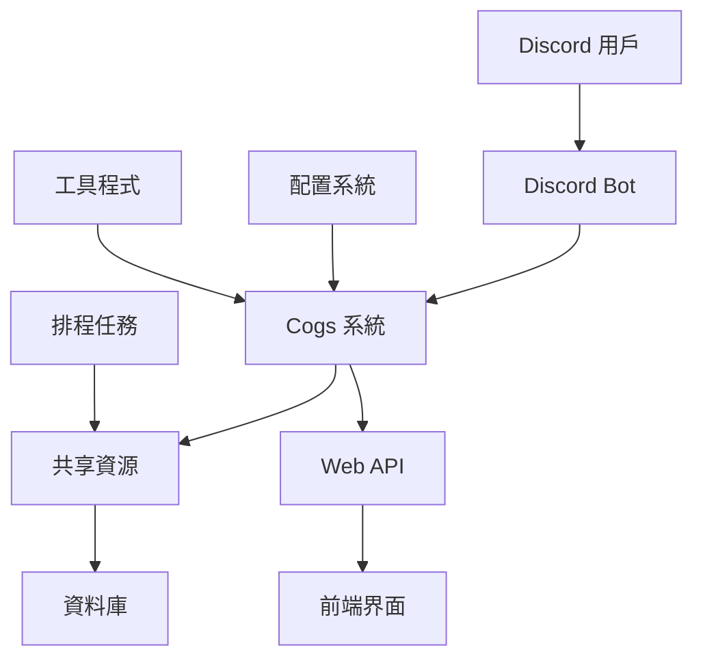

# KKGroup 專案架構總覽

## 專案概述

KKGroup 是一個基於 Discord 的多功能機器人系統，包含遊戲、商店、UI 管理等多個模組，部署在 GCP VM 上。

## 核心架構

### 1. Discord Bot 系統 (`bots/`)
- **主 Bot** (`bot.py`): 核心機器人功能
- **商店 Bot** (`shopbot.py`): 處理商店相關功能
- **UI Bot** (`uibot.py`): 處理用戶界面相關功能
- **啟動入口** (`__main__.py`): 統一的啟動點

### 2. Cogs 模組系統 (`cogs/`)
採用模組化設計，分為三大類別：

#### Common Cogs (`cogs/common/`)
- 通用功能模組
- 工作函數 (`work_function/`)
- AI 相關功能 (`AI.py`)
- 16個核心功能模組

#### Shop Cogs (`cogs/shop/`)
- 商家系統 (`merchant/`)
- 醫院商家 (`HospitalMerchant.py`)
- 大麻相關功能 (`cannabis_cog.py`)
- 7個商店相關模組

#### UI Cogs (`cogs/ui/`)
- 用戶界面管理
- 指令處理 (`commands/`)
- 事件處理 (`events/`)
- 頭像重置 (`AvatarReset.py`)
- 詐騙公園事件 (`ScamParkEvents.py`)
- 16個UI相關模組

### 3. Web 系統 (`web/`)
#### API 層 (`web/api/`)
- **API 伺服器** (`api_server.py`): 主要 API 服務
- **遊戲 API** (`game_api.py`): 遊戲相關 API
- **藍圖系統** (`blueprints/`): 模組化路由
  - Discord 認證 (`discord_auth.py`)
  - 表格驅動資料庫 (`sheet_driven_db.py`)
  - 6個藍圖模組

#### 前端 (`web/portal/`)
- **主頁面** (`index.html`): 主要入口
- **RPG 遊戲** (`rpg-game-tailwind.html`): HTML5 遊戲
- **靜態資源** (`static/`): CSS/JS/圖片

#### 活動系統 (`web/activities/`)
- 商家活動 (`merchant/`)

### 4. 共享資源 (`shared/`)
#### 資料庫 (`shared/db/`)
- AI 記憶體 (`ai_memory.py`)
- 資料庫架構 (`database_schema.py`)
- 3個資料庫模組

#### 工具 (`shared/utils/`)
- 機器人狀態 (`bot_status.py`)
- 嵌入視圖 (`embed_views.py`)
- 5個工具模組

### 5. 工具程式 (`utils/`)
- 地震資訊 (`earthquake.py`)
- 環境變數 (`env.py`)
- GitHub 整合 (`github.py`)
- 5個工具模組

### 6. 配置系統 (`config/`)
- 主要配置 (`config.json`)
- 指令註冊表 (`commands_registry.json`)
- 公告輪播 (`announcement_carousel.json`)
- Nginx 配置 (`nginx/`)
- 服務配置 (`services/`)
- 腳本 (`scripts/`)

### 7. 排程任務 (`scheduled_tasks/`)
- 自動更新配置 (`auto_update_config.py`)
- 自動更新 Webhook (`auto_update_webhook.py`, `auto_update_webhook_v2.py`)
- 儲物櫃維護 (`locker_maintenance.py`)
- 表格同步 (`sync_to_sheet.py`)
- 更新重啟 (`update_restart.py`)
- 每週備份 (`weekly_backup.py`)
- 7個排程任務

### 8. 腳本系統 (`scripts/`)
- 指令管理器 (`commands_manager.py`)
- 知識庫相關腳本
- 更新隧道 URL 腳本

### 9. 資源檔案
- **字體** (`fonts/`): 中文字體支援
- **角色圖片** (`character_images/`): Discord 頭像快取
- **資產** (`assets/`): 遊戲資源圖片
- **反應角色** (`reaction_roles/`): Discord 反應角色配置

### 10. 歸檔系統 (`archive/`)
- 備份 (`backups/`)
- 舊版本 (`old_versions/`)
- 系統配置備份 (`systemd/`)
- 修復腳本集合

## 資料流向

## 關鍵技術棧

### 後端
- **Python**: 主要開發語言
- **discord.py**: Discord API 整合
- **Flask**: Web API 框架
- **SQLite**: 本地資料庫
- **asyncio**: 非同步處理

### 前端
- **HTML5/CSS3**: 基礎網頁技術
- **TailwindCSS**: 樣式框架
- **JavaScript**: 互動功能

### 部署與維運
- **GCP VM**: 主要部署環境
- **systemd**: 服務管理
- **nginx**: 反向代理
- **Cloudflare Tunnel**: 隧道服務
- **Git**: 版本控制
- **Cron**: 排程任務

## 安全考量

- **環境變數**: `.env` 檔案儲存敏感資訊
- **Git 忽略**: 確保機密檔案不被提交
- **服務隔離**: 不同功能分離為獨立服務
- **權限控制**: Discord 權限系統整合

## 擴展性設計

- **模組化 Cogs**: 易於添加新功能
- **藍圖系統**: API 模組化
- **配置驅動**: 通過配置檔案控制行為
- **共享資源**: 減少重複程式碼

## 效能優化

- **非同步處理**: 大量使用 asyncio
- **快取機制**: Discord URL 快取
- **排程任務**: 自動維護和清理
- **資源池**: 連線池和資源管理

## 監控與日誌

- **系統服務**: systemd 日誌
- **應用日誌**: 自定義日誌系統
- **狀態儀表板**: `status_dashboard.py`
- **錯誤追蹤**: 完整的錯誤處理機制

## 相關文檔

- [Discord Bot 系統詳情](../entities/bot-services.md)
- [VM 操作指南](../entities/vm-operations.md)
- [Webhook 和隧道設定](webhook-and-tunnel.md)
- [編碼規則和路徑](coding-rules-and-paths.md)
- [指令註冊表](../entities/command-registry.md)
